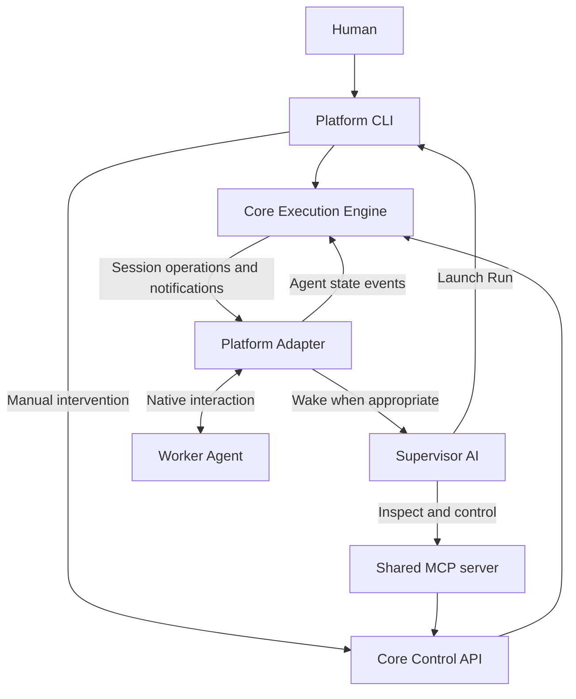
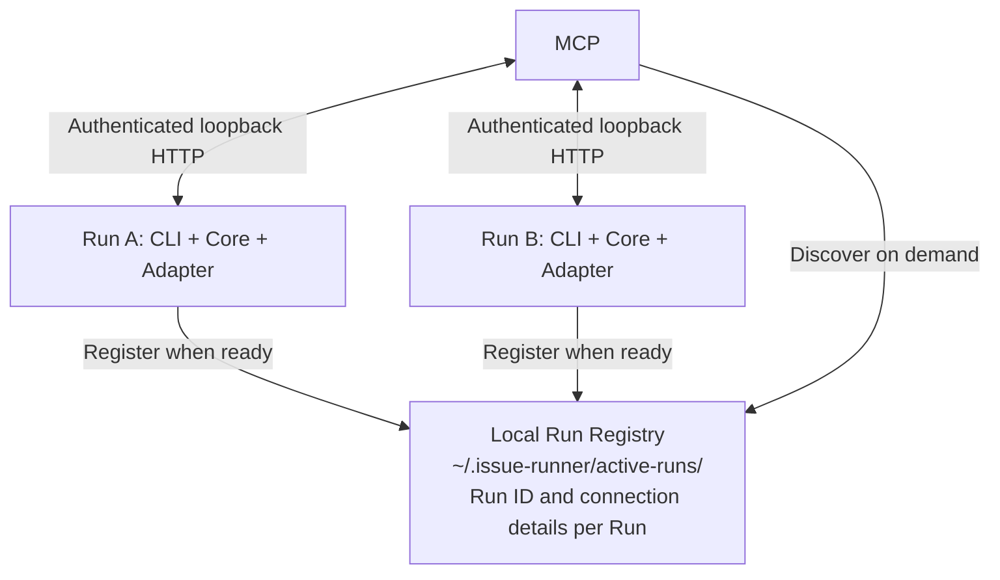
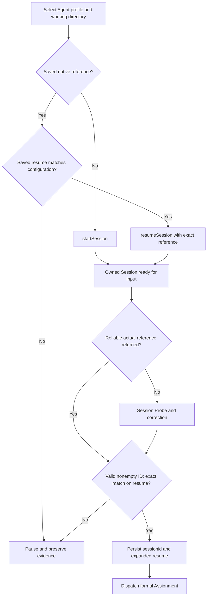
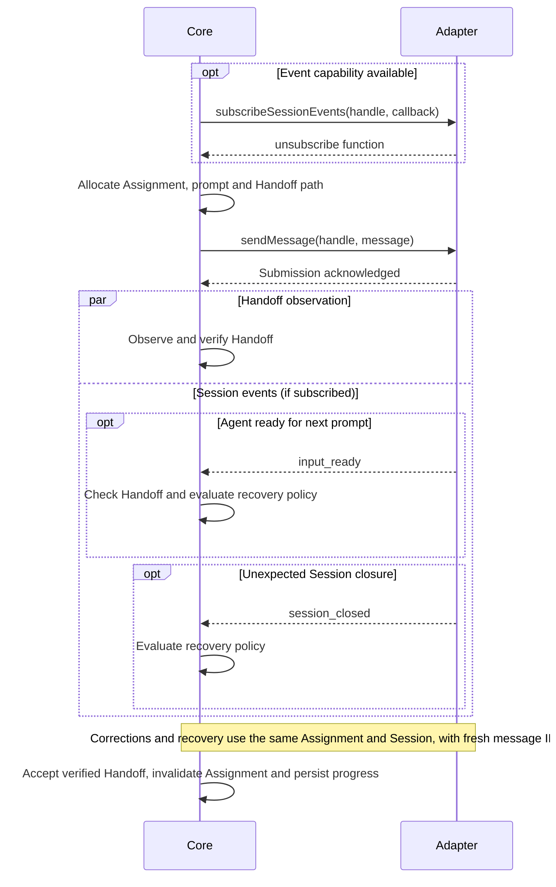
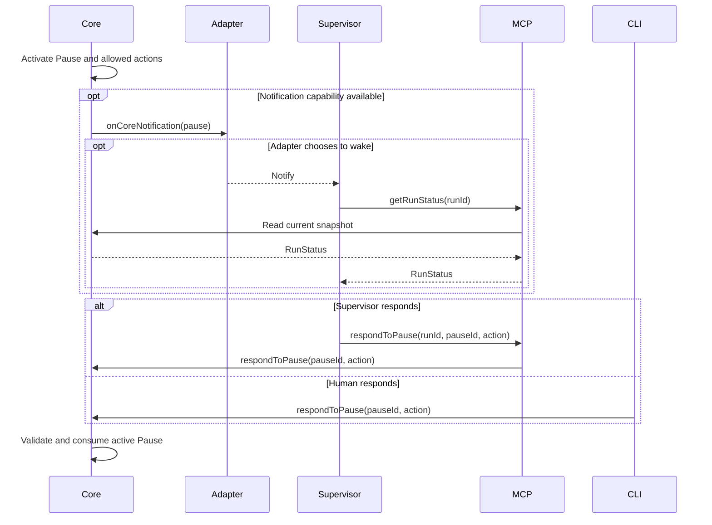
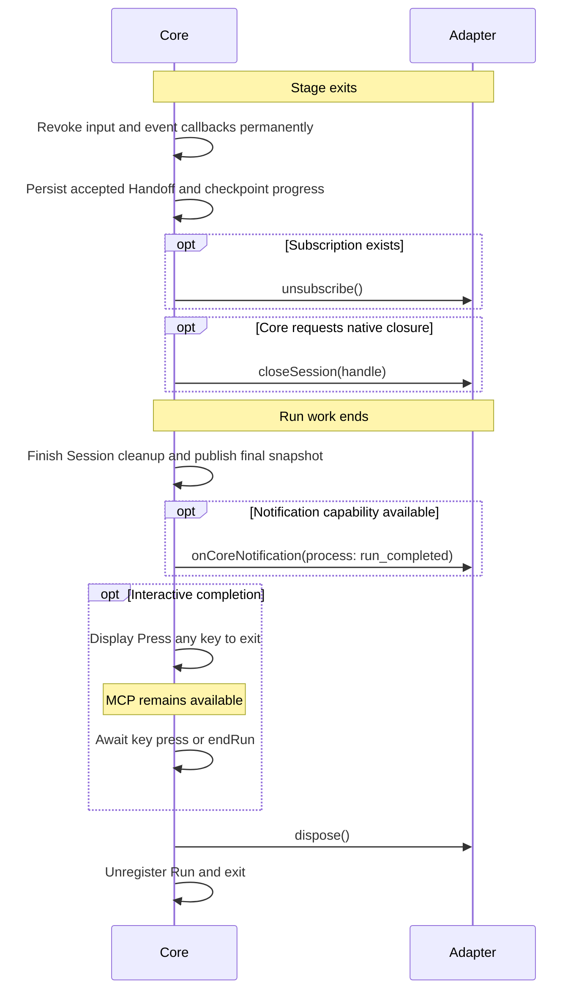

# Public integration contract

## Responsibilities and public entries


```mermaid
flowchart TD
    Human["Human"] --> CLI["Platform CLI"]
    Supervisor["Supervisor AI"] -->|Launch Run| CLI
    CLI --> Core["Core Execution Engine"]
    CLI -->|Manual intervention| Control["Core Control API"]
    Supervisor -->|Inspect and control| MCP["Shared MCP server"]
    MCP --> Control
    Control --> Core
    Core -->|Session operations and notifications| Adapter["Platform Adapter"]
    Adapter -->|Agent state events| Core
    Adapter -->|Wake when appropriate| Supervisor
    Adapter <-->|Native interaction| Worker["Worker Agent"]
```

| Public entry | Consumer | Responsibility |
| --- | --- | --- |
| `issue-runner-core/cli` | Platform CLI | Run launch, manual interaction, MCP routing |
| `issue-runner-core/adapter` | Platform Adapter | Version, interfaces, and shared data types |
| `issue-runner-core/mcp` | CLI | Provider-independent MCP server |

Platform packages depend on Core and own their executables. CLI and MCP share the internal Core Control API.

## Shared identities and data

```typescript
// IDs are nonempty strings, Issue numbers are positive safe integers,
// and times use ISO 8601 UTC.
export type RunId = string; // Unique per live CLI invocation, including restart.
export type ExecutionId = string; // One Issue execution within a Run.
export type AssignmentId = string; // Core request with an expected Handoff.
export type MessageId = string; // Unique Core message submission.
export type PauseId = string; // Unique unresolved intervention.
export type NativeSessionReference = string; // Persistable native conversation ID.
export type SessionHandle = object; // Adapter-owned live target held in memory.

export type Stage =
  | "implement" | "review" | "fix_review"
  | "ci_repair" | "conflict_repair" | "documentation";

// Requested CLI work selection.
export type RunSelection =
  | { kind: "parent"; issueNumber: number }
  | { kind: "issue"; issueNumber?: number } // Omit to use configured issueList.
  | { kind: "document" }; // Core creates or restores the Maintenance Ticket.
```

```typescript
export interface RunIdentity {
  runId: RunId;
  project: string;
  repository: string;
  selection: RunSelection;
  targetBranch: string;
  autoMerge: boolean;
  startedAt: string; // ISO 8601 UTC.
}

// Include available, applicable facts.
export interface IssueContext {
  issueNumber: number;
  executionId?: ExecutionId;
  stage?: Stage;
  assignmentId?: AssignmentId;
  worktree?: string; // Worktree for the current Issue phase.
  nativeSessionReference?: NativeSessionReference;
}

export type WorkScope =
  | { kind: "run" }
  | { kind: "issue"; issue: IssueContext };
```

## CLI integration

```typescript
export interface CliOptions {
  commandName: string; // Installed platform executable name for help and errors.
  commandVersion: string; // Platform package version.
  adapter: PlatformAdapterModule; // Platform-provided versioned module.
}

// Reads process argv and cwd. Owns operator input and cancellation signals.
// Validates inputs before workflow effects. Sets process.exitCode and returns.
// Creates resources on invocation and removes process listeners on return.
export declare function runCli(options: CliOptions): Promise<void>;
```

```typescript
// Platform-owned executable.
import { runCli } from "issue-runner-core/cli";
import * as adapter from "./adapter.js";

await runCli({
  commandName: "issue-runner-platform",
  commandVersion: "1.0.0",
  adapter,
});
```

```text
init --project <key>
run --project <key> --parent <number>
run --project <key> --issue [<number>]
run --project <key> --document
--help
--version
mcp
```

- Preserve existing argument restrictions, configuration location, merge flags, manual confirmation behavior, and exit codes.
- Instantiate the Adapter for Run execution. Route mcp directly to the shared MCP server.
- Each Run executes in the launching CLI process.

## Platform Adapter interfaces

### Module and initialization

```typescript
export declare const adapterContractVersion: 1; // Independent of npm version.

export type PlatformAdapterConfig = Readonly<Record<string, unknown>>;

export interface PlatformAdapterModule {
  readonly contractVersion: typeof adapterContractVersion;
  // One instance per Run. Core validates version before invoking this factory.
  // Validate platform settings and native context; clean up untransferred
  // resources on failure. Core validates methods before workflow effects.
  // Validate each provided optional method.
  createPlatformAdapter(
    config: PlatformAdapterConfig, // platformAdapter mapping; defaults to {}.
  ): Promise<PlatformAdapter>;
}
```

### Session operations

```typescript
export interface SessionOptions {
  command: string; // Full start command or expanded resume command.
  cwd: string; // Absolute, existing stage work directory.
  label: string; // Display name.
  signal: AbortSignal; // Run cancellation plus Session revocation.
}

export interface ResumeSessionOptions extends SessionOptions {
  nativeSessionReference: NativeSessionReference; // Exact saved reference.
}

export interface OpenedSession {
  handle: SessionHandle; // Unique owned live target.
  nativeSessionReference?: NativeSessionReference; // Actual ID if reliable.
}

export interface AgentMessage {
  messageId: MessageId; // Fresh ID for this submission.
  assignmentId: AssignmentId; // Current Assignment, including identity Probe.
  text: string; // Complete prompt, correction, or recovery message.
}
```

```typescript
export interface PlatformAdapter {
  // Open a new owned Session; resolve when ready to receive input.
  startSession(options: SessionOptions): Promise<OpenedSession>;
  // Restore the exact conversation; resolve when ready for input.
  resumeSession(options: ResumeSessionOptions): Promise<OpenedSession>;
  // Resolve on acknowledged submission.
  // Preserve the LF-normalized text supplied by Core.
  sendMessage(handle: SessionHandle, message: AgentMessage): Promise<void>;
  // Close the owned representation; an already closed target is a success.
  closeSession(handle: SessionHandle): Promise<void>;
  // Core calls once per transferred instance, even after late initialization.
  // Release Run-level resources; preserve retained Sessions and history.
  // Preserve the Supervisor.
  dispose(): Promise<void>;

  // Optional. Return async, idempotent subscription cleanup.
  // Enables state-driven recovery during Assignment execution.
  subscribeSessionEvents?(
    handle: SessionHandle,
    onEvent: (event: AgentEvent) => void,
  ): Promise<() => Promise<void>>;

  // Optional. Receive Core notifications for platform-specific handling.
  onCoreNotification?(notification: CoreNotification): void | Promise<void>;
}
```

- Validate handle ownership and working directory support before operations. Target the Session identified by its handle.
- Core serializes input per Session, while independent Sessions run concurrently.
- Check the bound signal before new automatic operations. Revocation stops further input. Keep the input queue until the submission settles. Explicit cleanup may still target the same owned handle.
- The two optional methods are independent.

### Failure contract

Adapter manages resources before returning a Session Handle and throws `Error` on failure with any retained resource details. Core records errors and applies recovery policy, pausing on uncertain launch or submission outcomes.

## Optional capabilities

### Agent state events

```typescript
export type AgentEvent =
  | { type: "session_closed" } // Unexpected Session closure.
  | { type: "input_ready" }; // Execution ended; Agent can accept another ordinary prompt.
```

- Subscribe before dispatch. Adapter observes the Session throughout the subscription, reconciles interruptions, and pushes current events in order.
- On `input_ready`, Core checks the current Assignment's Handoff and applies its recovery policy.
- Adapter handles Agent requests for intervention through the platform and Supervisor AI. Core continues observing Handoff.

### Core notifications

```typescript
export interface ErrorDetail {
  code: string; // Machine-readable diagnostic.
  message: string; // Sanitized human-readable explanation.
}

export type PauseAction =
  | "continue" // Acknowledge the intervention.
  | "retry" // Repeat an eligible operation.
  | "restart" // Restart the affected workflow explicitly.
  | "skip" // Skip only when Core permits it.
  | "cancel"; // Cancel the Run and exit.

export interface PauseDetails {
  pauseId: PauseId;
  scope: WorkScope; // Affected Run or Issue.
  state: "active" | "queued"; // CLI confirmation state.
  message: string; // Human-readable intervention prompt.
  allowedActions: readonly PauseAction[]; // Actions legal at snapshot time.
  openedAt: string; // ISO 8601 UTC.
  operation: string; // Core operation requiring intervention.
  reason: ErrorDetail;
  pullRequest?: PullRequestRef; // Diagnostic references, when applicable.
  handoffPath?: string;
  logPath?: string;
}
```

```typescript
export type CoreNotification =
  // Emit when a Pause becomes active.
  | {
      type: "pause";
      runId: RunId;
      pause: PauseDetails;
    }
  // Each delivery Batch and Documentation Maintenance occurrence.
  | {
      type: "process";
      runId: RunId;
      event: "batch_completed";
      message: string; // E.g. "Batch 1 completed" or "Documentation Maintenance completed".
      completedIssues: readonly number[]; // Completed Issue numbers in this Batch.
    }
  | {
      type: "process";
      runId: RunId;
      event: "run_completed";
      message: string; // "Run completed".
    };
```

- Adapter decides when to wake the Supervisor. The Supervisor queries full progress and final results through MCP.
- Initiate asynchronous deliveries in emission order. Report delivery failures separately.
- CLI displays actionable errors, Pause prompts, and control results. Terminal progress and result output are refined in #477.

## Configuration

```typescript
export interface AgentConfig {
  start: string; // Opaque, nonempty command; passed unchanged.
  resume: string; // Required {sessionref}; Core replaces each occurrence literally.
}

export type AgentProfiles = {
  implement: AgentConfig;
  ciRepair: AgentConfig;
  conflictRepair: AgentConfig;
  review?: AgentConfig; // Required when Review is enabled.
  documentation?: AgentConfig; // Required for documentation workflows.
};
```

```yaml
agents:
  implement:
    start: 'codex --model gpt-5.4 -c model_reasoning_effort=high'
    resume: 'codex resume "{sessionref}"'

platformAdapter: {} # Adapter-owned settings; opaque to Core.
```

- Preserve role selection and the rest of Project configuration.
- Users specify Provider, model, effort, and launch arguments in commands. Adapter executes the command using its platform format.

## Core Control API and MCP

### State and result types

```typescript
export interface PullRequestRef {
  number: number;
  url: string;
  title?: string;
}

export type RunOutcome =
  | "succeeded" | "no_work" | "incomplete" | "cancelled" | "failed";

export type IssueOutcome =
  | "completed" | "pr_ready" | "no_change" | "no_work"
  | "incomplete" | "cancelled" | "failed";

// User-facing workflow phases.
export type IssuePhase =
  | "pending" | "preparing" | "agent" | "publishing"
  | "waiting_for_ci" | "waiting_for_merge" | "cleanup" | "completed";

export interface IssueStatus {
  issue: IssueContext; // Current Stage and Session context when applicable.
  kind: "delivery" | "maintenance";
  phase: IssuePhase;
  pullRequest?: PullRequestRef;
  outcome?: IssueOutcome; // Final Issue result.
  detail?: string; // Current status or outcome explanation.
}

export interface LiveRun {
  run: RunIdentity;
  state: "running"
    | "paused" // Run-wide intervention; local Issue Pauses remain in pauses.
    | "cancelling"
    | "completed";
}

// Current progress and final results in one snapshot.
export interface RunStatus extends LiveRun {
  issues: readonly IssueStatus[]; // All planned Issues, including pending, active, and completed.
  pauses: readonly PauseDetails[]; // Active and queued unresolved Pauses.
  logPath?: string;
  outcome?: RunOutcome; // Final Run result.
  finishedAt?: string; // ISO 8601 UTC.
  failure?: ErrorDetail;
}
```

### Per-Run control

```typescript
// One live Run; CLI and MCP invoke the same operations.
interface RunControl {
  readonly runId: RunId;
  getStatus(): Promise<RunStatus>; // Read-only current snapshot.
  // Check current identity, active state, and legal action atomically.
  // The first valid response consumes the active Pause.
  respondToPause(
    pauseId: PauseId, action: PauseAction,
  ): Promise<void>;
  // Cancel an active Run and exit after cleanup, or exit a completed Run.
  end(): Promise<void>;
}
```

- Proposed FIFO policy: inspect queued Pauses and respond to the active Pause. Each Pause carries its own scope.
- Preserve existing CLI key mappings.
- Completed Runs expose their final snapshot until a key press or `endRun`. Core validates control operations and throws `Error` on invalid requests.

### MCP startup and tools

```typescript
// issue-runner-core/mcp
// Started by the AI client through the platform CLI's mcp subcommand.
// Stdio transport: stdout carries protocol traffic, stderr carries diagnostics.
// Connects to independently running CLI instances.
export declare function runMcp(): Promise<void>;
```

```json
{
  "mcpServers": {
    "issue-runner": {
      "command": "issue-runner-platform",
      "args": ["mcp"]
    }
  }
}
```

```typescript
// MCP input and structured result schemas.
// Same tool names across platform CLIs. External operations target a live Run.
export interface McpTools {
  listRuns(): Promise<readonly LiveRun[]>; // Discover live Runs.
  getRunStatus(input: { runId: RunId }): Promise<RunStatus>; // Progress, Pauses, and results.
  respondToPause(input: {
    runId: RunId; pauseId: PauseId; action: PauseAction;
  }): Promise<void>;
  endRun(input: { runId: RunId }): Promise<void>; // Acknowledge before shutting down the Run.
}
```

MCP returns tool errors for failed operations.

### Local Run discovery


```mermaid
flowchart TD
    A["Run A: CLI + Core + Adapter"] -->|Register when ready| Registry["Local Run Registry<br/>~/.issue-runner/active-runs/<br/>Run ID and connection details per Run"]
    B["Run B: CLI + Core + Adapter"] -->|Register when ready| Registry
    MCP -->|Discover on demand| Registry
    MCP <-->|Authenticated loopback HTTP| A
    MCP <-->|Authenticated loopback HTTP| B
```

Bind each Run to an available loopback port. Protect registry credentials with OS-user access controls and validate authorization, compatibility, and Run ID on every connection. Registry and HTTP schemas are separate design work.

## Lifecycle and failure flows

### Startup and exact resume


```mermaid
flowchart TD
    Begin["Select Agent profile and working directory"] --> Mode{"Saved native reference?"}
    Mode -->|No| Start["startSession"]
    Mode -->|Yes| Saved{"Saved resume matches configuration?"}
    Saved -->|Yes| Resume["resumeSession with exact reference"]
    Saved -->|No| Pause["Pause and preserve evidence"]
    Start --> Ready["Owned Session ready for input"]
    Resume --> Ready
    Ready --> Ref{"Reliable actual reference returned?"}
    Ref -->|Yes| Match{"Valid nonempty ID; exact match on resume?"}
    Ref -->|No| Probe["Session Probe and correction"]
    Probe --> Match
    Match -->|No| Pause
    Match -->|Yes| Persist["Persist sessionid and expanded resume"]
    Persist --> Dispatch["Dispatch formal Assignment"]
```

### Assignment and Handoff


```mermaid
sequenceDiagram
    participant Core
    participant Adapter
    opt Event capability available
        Core->>Adapter: subscribeSessionEvents(handle, callback)
        Adapter-->>Core: unsubscribe function
    end
    Core->>Core: Allocate Assignment, prompt and Handoff path
    Core->>Adapter: sendMessage(handle, message)
    Adapter-->>Core: Submission acknowledged
    par Handoff observation
        Core->>Core: Observe and verify Handoff
    and Session events (if subscribed)
        opt Agent ready for next prompt
            Adapter-->>Core: input_ready
            Core->>Core: Check Handoff and evaluate recovery policy
        end
        opt Unexpected Session closure
            Adapter-->>Core: session_closed
            Core->>Core: Evaluate recovery policy
        end
    end
    Note over Core,Adapter: Corrections and recovery use the same Assignment and Session, with fresh message IDs.
    Core->>Core: Accept verified Handoff, invalidate Assignment and persist progress
```

### Pause and notification


```mermaid
sequenceDiagram
    participant Core
    participant Adapter
    participant Supervisor
    participant MCP
    participant CLI
    Core->>Core: Activate Pause and allowed actions
    opt Notification capability available
        Core->>Adapter: onCoreNotification(pause)
        opt Adapter chooses to wake
            Adapter-->>Supervisor: Notify
            Supervisor->>MCP: getRunStatus(runId)
            MCP->>Core: Read current snapshot
            Core-->>MCP: RunStatus
            MCP-->>Supervisor: RunStatus
        end
    end
    alt Supervisor responds
        Supervisor->>MCP: respondToPause(runId, pauseId, action)
        MCP->>Core: respondToPause(pauseId, action)
    else Human responds
        CLI->>Core: respondToPause(pauseId, action)
    end
    Core->>Core: Validate and consume active Pause
```

### Stage exit and Run disposal


```mermaid
sequenceDiagram
    participant Core
    participant Adapter
    Note over Core,Adapter: Stage exits
    Core->>Core: Revoke input and event callbacks permanently
    Core->>Core: Persist accepted Handoff and checkpoint progress
    opt Subscription exists
        Core->>Adapter: unsubscribe()
    end
    opt Core requests native closure
        Core->>Adapter: closeSession(handle)
    end
    Note over Core,Adapter: Run work ends
    Core->>Core: Finish Session cleanup and publish final snapshot
    opt Notification capability available
        Core->>Adapter: onCoreNotification(process: run_completed)
    end
    opt Interactive completion
        Core->>Core: Display Press any key to exit
        Note over Core: MCP remains available
        Core->>Core: Await key press or endRun
    end
    Core->>Adapter: dispose()
    Core->>Core: Unregister Run and exit
```

Unsubscribe late-transferred subscriptions immediately. Retry cleanup on the original target; retain and report incomplete resources.
